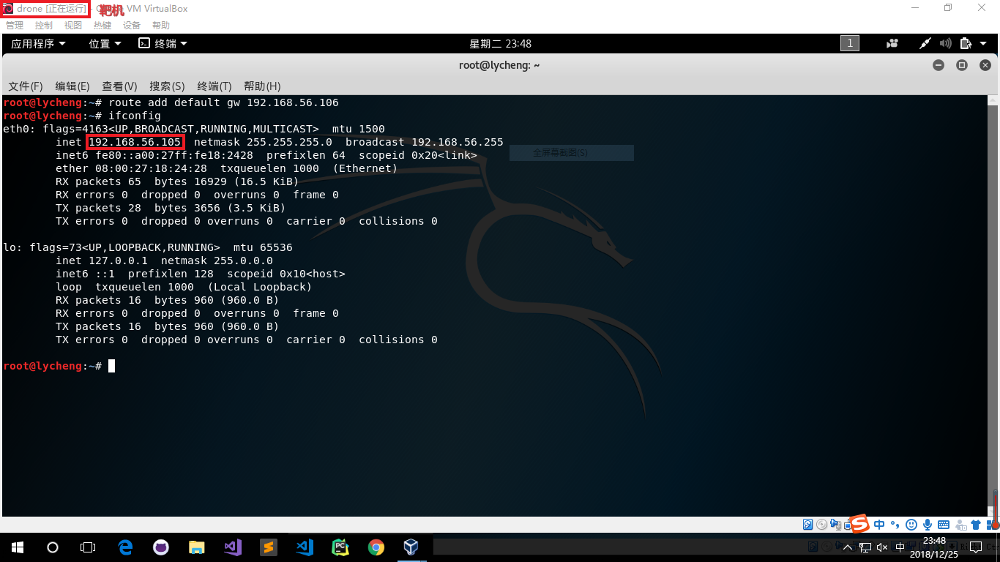

# ARP欺骗与MITM 理论

## 简述中间人攻击

黑客攻击中一个较为经典的攻击就是中间人攻击。在这次攻击中，黑客将自己置于客服端和服务器端之间，从而可以访问两者之间的流量

通常，当攻击者想要将自己置于客服端和服务器之间时，他们需要欺骗两个系统的ARP。这不是进行MiTM的唯一方法，但它可能是局域网（LAN）上最常见的方法

MiTM攻击是黑客攻击最受欢迎和最有效的攻击之一。在最简单的形式中，MiTM就是攻击者将自己放置在客服端和服务器之间的地方，并允许所有流量透明地通过他们的系统。这要求攻击者说服服务器他是客服端**并**说明客服端他们是服务器。当然，这两个系统的风险在于中间人可以看到他们的所有流量，如果他们选择，则可以改变数据包

MiTM攻击的风险：

- 嗅探密码

- 间谍活动

- 通信损坏或改变

- 冒充

## 什么是ARP

ARP是地址解析协议，它在物理MAC地址和逻辑IP地址之间进行转换。实质上，它将网络层地址转换为数据链路层地址。这使得网络交换机和其他网络设备能够识别哪个NIC卡具有哪个IP地址，从而向每个系统发送正确的数据包

在局域网的任意一台主机中，都有一个ARP缓存表，里面保存本机已知的此局域网中各主机个路由器的IP地址和MAC地址的对照关系。ARP缓存表的生命周期是有时限的（一般不超过20分钟）

## 可能会造成的后果

一旦中间人建立攻击成功，就可以拦截客户端和服务器端的流量，就可以造成许多的攻击

可能造成的攻击：

- 监控目标的上网行为

- 劫持目标的cookie从而用目标账号登陆第三方网站，浏览器隐私数据和进行其他操作

- 钓鱼攻击，使目标下载恶意程序或者执行恶意脚本，从而威胁其计算机安全

## ARP攻击防范

1. 双向绑定

    一般来说，在小规模网络中，比较推荐使用双向绑定，也就是在路由器和终端上都有进行IP-MAC绑定的措施，它可以对ARP欺骗的双方、伪造网关、截获数据，都具有约束的作用。这是从ARP欺骗原理上进行的防范措施，也是最普遍应用的方法。它对付最普通的ARP欺骗是有效的

2. ARP防火墙

    在一些杀毒软件中加入了ARP防火墙的功能，它是通过在终端电脑上对网关进行绑定，保证不受网络中假网关的影响，从而保护自身数据不被窃密的措施。ARP防火墙使用范围很广，但也会有问题，如它不能保证绑定的网关一定是正确的。如果一个网络中已经发生了ARP欺骗，有人在伪造网关，那么ARP防火墙上来就会绑定这个错误的网关，这是具有极大风险的

3. VLAN和交换机端口绑定

    通过划分VLAN和交换机端口绑定来防范ARP，也是常用的防范方法。做法是细致地划分VLAN，减小广播域的范围，使ARP在小范围内起作用，而不至于发送大面积影响。同时，一些网管交换机具有MAC地址学习的功能，学习完成后，再关闭这个功能，就可以把对应的MAC和端口进行绑定，避免了病毒利用ARP攻击篡改自身地址。也就是说，把ARP攻击中被截获数据的风险解除了。

-----

# ARP欺骗与MITM 实验

## 网络拓扑图

- 靶机 drone

    - eth0 host-only 192.168.56.105

- 网关 gateway

    - eth0 NAT网络 10.0.2.6

    - eth1 host-only 192.168.56.106

- 攻击者 attack

    - eth0 host-only 192.168.56.102

## 相关配置及要求

- 靶机 drone

        route add default gw 192.168.56.106

- 网关 gateway

        echo 1 > /proc/sys/net/ipv4/ip_forward

        iptables -t nat -A POSTROUTING -o eth0 -s 192.168.56.105/24 -j MASQUERADE

        iptables -t nat -A POSTROUTING -o eth0 -s 192.168.56.102/24 -j MASQUERADE

        iptables-save -c > iptables.rules

- 攻击者 attack

        route add default gw 192.168.56.106

- 要求

    - 保证三台虚拟机之间的连通性

    - 三台虚拟机都可以上网

## 实验一 ettercap进行中间人欺骗

1. 查看各虚拟机网络设置

- 靶机

- 网关

- 攻击者

2. 查看各虚拟机arp表

- 靶机

- 网关

- 攻击者

3. 开始进行中间人攻击

- 在攻击者主机上开启ettercap

        ettercap -G

5. 打开ettercap-NG 的图形界面之后点击`sniff`，选择`unified sniffing`然后根据自己的要求选择要抓包的网卡

6. 单击`Hosts`选项，选择`Scan for host`，然后选择`Host list`，此时可以看到ettercap-NG已经扫描的主机列表

7. 选择要进行攻击的目标

    - 选择靶机`192.168.56.105`的IP地址，点击`Add to Target 1`

    - 选择网关`192.168.56.106`的IP地址，点击`Add to Target 2`

8. 选择`mitm` —> `arp poisoning` —> `Sniff remote connections` —> `确定`

9. 再次查看各虚拟机arp表，发现已被毒化

- 靶机

- 网关

攻击者转发靶机与网关的通信

## 实验二 arpspoof进行中间人欺骗

网络配置遵循实验一

1. 使用arpspoof进行arp欺骗

        arpspoof -i eth0 -t 192.168.56.105 -r 192.168.56.106
    
    查看arp表，发现arp欺骗成功

## 参考

- [ARP协议揭密](https://www.ibm.com/developerworks/cn/linux/l-arp/)

- [关于ARP欺骗与MITM（中间人攻击）的一些笔记](https://www.2cto.com/article/201305/208754.html)

- [ARP欺骗与MITM（中间人攻击）实例](https://www.cnblogs.com/sinton/p/4986225.html)

- [Man-the-Middle (MiTM) Attack with ARPspoofing](https://www.hackers-arise.com/single-post/2017/07/25/Man-the-Middle-MiTM-Attack-with-ARPspoofing)