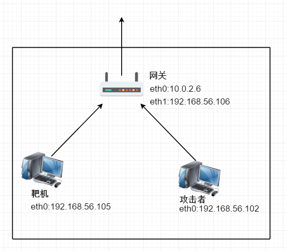

# DNS查询泄漏与MITM

## 简述

当我们需要去访问一个网站时，我们大部分情况下是通过它的域名去进行访问，此时就需要DNS服务器将域名转换为数字IP地址，数字IP地址是我们发送路由数据包所需要的。每当我们的计算机需要联系Internet上的服务器时，，例如在游览器内输入URL，计算机将会联系DNS服务器请求IP地址。大多数Internet服务器供应商会为其客户分配一个DNS服务器，他们控制并使用它来记录Internet活动

一般情况下这个NameServer是ISP指定的，所以ISP可以完全控制此NameServer，故可以记录你的地址解析活动，所以当你做某些事情时，实际上已经被记录跟踪在案了

某些情况下，即使连接到匿名网络，操作系统仍将继续使用默认DNS服务器，而不是匿名网络分配给你的匿名DNS服务器，这时又会被ISP记录在案了

DNS泄密是一种主要的隐私威胁，因为匿名网络可能在私有数据泄露时提供错误的安全感

## 透明DNS代理

一些ISP现在正在使用一种名为“透明DNS代理”的技术。使用此技术，ISP将拦截所有DNS请求并透明地进行代理，这将迫使你在不知情的情况下去使用ISP指定的NameServer

即使你已经将DNS设置更改为使用“开放”DNS服务（如Google、Comodo或OpenDNS），以期望你的DNS流量不再发送到你的ISP的DNS服务器，但你可能被进行了透明的DNS代理

如果你的ISP实现了透明的DNS代理，那么使用DNS泄露修复时非常重要的，以确保当你连接到VPN时，你的请求不会被拦截

## 如何修复DNS泄露

解决方案是确保一旦连接到VPN，就只使用VPN服务提供的DNS服务器

### OpenVPN v2.3.9+

从OpenVPN版本2.3.9开始，可以通过制定新的OpenVPN选项来防止DNS泄露，只需要打开要连接的服务器.conf(或.ovpn)文件，然后在新行上添加以下内容

    block-outside-dns

### 如果使用的是早于v2.3.9的OpenVPN版本

此问题通常仅影响Windows客服端，因此此处仅显示Windows解决方案

**解决问题的3个基本步骤：**

1. 在连接到VPN之前，如果使用DHCP，请设置静态IP地址属性

2. 连接后，删除主接口的DNS设置

3. 断开连接后，如有必要，请切换回DHCP或重新应用原始静态DNS服务器

**解决方案A - 自动**

如果在Windows XP / Vista / 7上使用OpenVPN，则可以使用完全自动化的解决方案

下载[dnsfixsetup.exe](https://www.dnsleaktest.com/dnsfixsetup.exe)- （md5 checksum：f212a015a890bd2dae67bc8f8aa8bfd9）

安装后，连接到VPN服务器时，将运行批处理文件执行上述3个步骤

为每个OpenVPN配置文件生成三个脚本

1. configfilename_pre.bat - 在启动连接时但在建立连接之前执行 - 调用pre.vbs - 如果存在任何活动的DHCP适配器，请切换到静态
2. configfilename_up.bat - 建立连接时执行 - 调用up.vbs - 清除除TAP32适配器之外的所有活动适配器的DNS服务器
3. configfilename_down.bat - 在断开连接后执行 - 调用down.vbs - 将适配器重新配置回其原始配置

**解决方案B - 手动清除DNS**

如果使用DHCP，下面的解决方案不会将适配器切换为静态。如果未切换到静态IP配置，并且计算机在连接​​到VPN时更新其IP地址，则DNS设置可能会被覆盖。强烈建议切换到静态IP配置

1. 以管理员身份打开命令提示符（cmd.exe）。

2. 在连接之前识别所连接的网络接口的名称。在下面的情况下，它是“本地连接”

        netsh interface show interface

3. 连接到VPN。连接后，继续下一步

4. 刷新DNS解析程序缓存

        ipconfig /flushdns

5. 禁用步骤1中标识的接口的DNS配置

        netsh interface IPv4 set dnsserver "Local Area Connection" static 0.0.0.0 both

6. [测试DNS泄漏](https://www.dnsleaktest.com/index.html)

7. 断开连接后，重新配置适配器以续订先前的DNS设置

        netsh interface IPv4 set dnsserver "Local Area Connection" dhcp

8. 再次刷新DNS解析器缓存

        ipconfig /flushdns

9. 完成

## DNS欺骗理论

DNS欺骗就是攻击者冒充域名服务器的一种欺骗行为

1. 欺骗原理

    Client的DNS查询请求和DNS Server的应答数据包是依靠DNS报文的ID表示来相互对应的。在进行域名解析时，Client首先用特定的ID号向DNS Server发送域名解析数据包，这个ID是随机产生的，将接收到的ID与请求包的ID对比，如果相同则说明接收到的数据包是直接所需要的，如果不同就丢弃此应答包。根据攻击者的查询和应答原理，可使用不同的方法实现攻击，如：

    1. 因为DNS Message仅使用一个简单的认证码来实施真实性验证，认证码是由Client程序产生并由DNS Server返回结果的，客户机只是使用这个认证码来辨别应答与申请查询是否匹配，这就使得针对ID认证码的攻击威胁成为可能

    2. 在DNS Request Message中可以增加信息，这些信息可以与客户机所申请查询的内容必然联系，因此攻击者就能在Request Message中根据自己的目的增加某些虚假的信息，比如增加其他Domain Server的Domain Name及其IP Address。此时Client在受到攻击的Domain Server上查询申请均被转向此前攻击者在Request Message中增加的虚假Domain Server，由此DNS欺骗得以产生并对网络构成威胁

    3. 当DNS Server接收到Domain Name和IP Address相互映射的数据时，就将其保存在本地的Cache中。若再有Client请求查询此Domain Name对应的IP Address，Domain Server将会从Cache中映射信息回复给Client，而无需在Database中再次查询。如果黑客将DNS Request Message的存在周期设定较长时间，就可进行长期欺骗

2. DNS欺骗攻击的方式

   DNS欺骗技术常见的有内应攻击和序列号攻击两种。

   - 内应攻击：即黑客在掌握一台DNS Server后，对其Domain Database内容进行更改，将虚假IP Address指定给特定的Domain Name，当Client请求查询这个特定域名的IP时，将得到伪造的IP

   - 序列号攻击：指伪装的DNS Server在真实的DNS Server之前向客户端发送应答数据报文，该报文中含有的序列号ID与客户端向真实的DNS Server发出请求数据包中含有的ID相同，因此客户端会接受该虚假报文，而丢弃晚到的真实报文，这样DNS ID序列号欺骗成功。客户机得到的虚假报文中提供的域名的IP是攻击者设定的IP，这个IP将把客户带到攻击者指定的站点

3. DNS序列号欺骗攻击原理

   DNS序列号(ID)欺骗以侦测ID和Port为基础。当Client、攻击者处在同一个网络时，首先需要进行ARP欺骗，攻击流程如下：

   1. 攻击方向目标反复发送伪造的ARP Request Message，修改目标机的ARP缓存内容，同时依靠IP续传使数据经过攻击方再流向目的地；攻击方侦测DNS请求包，获取ID序列号和Port

   2. 攻击方一旦获得ID和Port，即刻想客户机发送虚假的DNS Request Message，Client接受后验证ID和Port正确，认为接受了合法的DNS应答；而Client得到的IP可能被转向攻击方诱导的非法站点，从而使Client信息安全受到威胁

   3. Client再接受DNS Server的Request Message，因落后于虚假的DNS响应，故被Client丢弃。当Client访问攻击者指向的虚假IP时，一次DNS ID欺骗随机完成

4. DNS欺骗检测和防范思路

    1. 检测思路

        发生DNS欺骗时，Client最少会接收到两个以上的应答数据报文，报文中都含有相同的ID序列号，一个是合法的，另一个是伪装的。据此特点，有以下两种检测办法：

        1. 被动监听检测。即监听、检测所有DNS的请求和应答报文。通常DNS Server对一个请求查询仅仅发送一个应答数据报文(即使一个域名和多个IP有映射关系，此时多个关系在一个报文中回答)。因此在限定的时间段内一个请求如果会收到两个或以上的响应数据报文，则被怀疑遭受了DNS欺骗

        2. 主动试探检测。即主动发送验证包去检查是否有DNS欺骗存在。通常发送验证数据包接收不到应答，然而黑客为了在合法应答包抵达客户机之前就将欺骗信息发送给客户，所以不会对DNS Server的IP合法性校验，继续实施欺骗。若收到应答包，则说明受到了欺骗攻击

    2. 防范思路

        在侦测到网络中可能有DNS欺骗攻击后，防范措施有：
        
        1. 在客户端直接使用IP Address访问重要的站点，从而避免DNS欺骗;
        
        2. 对DNS Server和Client的数据流进行加密，Server端可以使用SSH加密协议，Client端使用PGP软件实施数据加密

        对于常见的ID序列号欺骗攻击，采用专业软件在网络中进行监听检查，在较短时间内，客户端如果接收到两个以上的应答数据包，则说明可能存在DNS欺骗攻击，将后到的合法包发送到DNS Server并对DNS数据进行修改，这样下次查询申请时就会得到正确结果

## DNS欺骗实验

1. 网络拓扑

    - 靶机 drone

        - eth0 host-only 192.168.56.105

    - 网关 gateway

        - eth0 NAT网络 10.0.2.6

        - eth1 host-only 192.168.56.106

    - 攻击者 attack

        - eth0 host-only 192.168.56.102

    

2. 相关配置及要求

   - 靶机 drone

                route add default gw 192.168.56.106

    - 网关 gateway

                echo 1 > /proc/sys/net/ipv4/ip_forward

                iptables -t nat -A POSTROUTING -o eth0 -s 192.168.56.105/24 -j MASQUERADE

                iptables -t nat -A POSTROUTING -o eth0 -s 192.168.56.102/24 -j MASQUERADE

                iptables-save -c > iptables.rules

   - 攻击者 attack

                route add default gw 192.168.56.106

   - 要求

        - 保证三台虚拟机之间的连通性

        - 三台虚拟机都可以上网

3. 修改攻击者主机上`/etc/ettercap/etter.dns`,使靶机进行DNS查询时得到的IP能被我们所篡改

        *       A       192.168.56.102
        *       PRT     192.168.56.102

   

4. 开启攻击者主机上服务器

        /etc/init.d/apache2 start
        # 若想要修改dns欺骗之后显示的网页，需要进入/var/www/html中修改index.html文件

    

5. 启动ettercap

        ettercap –G

6. ettercap进行中间人欺骗

   该部分可参考[ARP欺骗与MITM](ARP欺骗与MITM.md)

7. ARP欺骗成功后，进行DNS欺骗，选择`plugins` -> `manage the plugins`，在出现了窗口中，双击`dns_spoof`，完成DNS欺骗，无论靶机访问什么网址，最后都会访问到攻击者主机上的网页

    DNS欺骗前ping百度，显示的IP地址为`220.181.111.37`，经过查询，确实是百度的IP地址

    

    DNS欺骗后ping百度，显示的IP地址为攻击者主机的IP地址

    

## 参考

- [What is a DNS leak and why should I care?](https://www.dnsleaktest.com/what-is-a-dns-leak.html)

- [Transparent DNS proxies](https://www.dnsleaktest.com/what-is-transparent-dns-proxy.html)

- [how-to-fix-a-dns-leak](https://www.dnsleaktest.com/how-to-fix-a-dns-leak.html)

- [DNS欺骗攻击及如何防护](https://blog.csdn.net/jackliu16/article/details/79426241)

- [使用ettercap进行dns欺骗](https://blog.csdn.net/hy_696/article/details/74640519)

- [DNS查询泄露（经由DNS解析服务器）与MITM](https://github.com/kjAnny/ns/blob/collaboration/2017-2/zan_mw/MW/part1%20DNS%E6%9F%A5%E8%AF%A2%E6%B3%84%E6%BC%8F%EF%BC%88%E7%BB%8F%E7%94%B1DNS%E8%A7%A3%E6%9E%90%E6%9C%8D%E5%8A%A1%E5%99%A8%EF%BC%89%E4%B8%8EMITM.md)