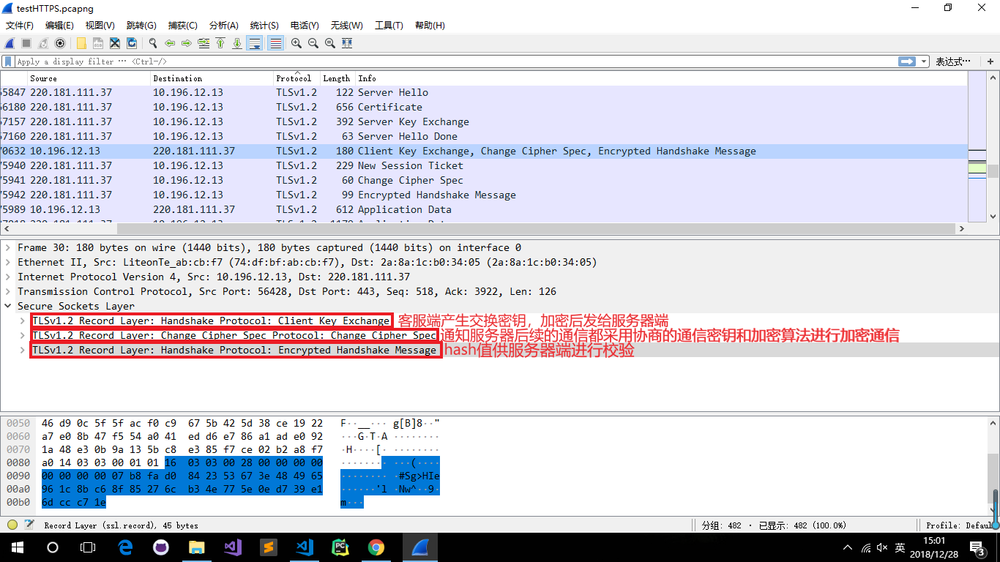

# HTTPS协议详解

## 1、 HTTPS协议说明

HTTPS(Hypertext Transfer Protocol over Secure Socket Layer)，是以安全为目标的HTTP通道，简单讲就是HTTP的安全版。其实现是在HTTP下加入SSL层，HTTPS的安全基础是SSL，因此加密的详细内容就需要SSL。

SSL协议位于TCP/IP协议与各种应用协议之间，是一种国际标准的加密及身份认证通信协议，为TCP提供一个可靠的端到端的安全服务，为两个通讯个体之间提供保密性和完整性。SSL层所处位置如下

## 2、 SSL协议

### 2.1 SSL协议说明

SSL协议位于TCP/IP协议与各种应用层协议之间，为数据通讯提供安全支持。SSL协议可分为两层： SSL记录协议（SSL Record Protocol）：它建立在可靠的传输协议（如TCP）之上，为高层协议提供数据封装、压缩、加密等基本功能的支持。 SSL握手协议（SSL Handshake Protocol）：它建立在SSL记录协议之上，用于在实际的数据传输开始前，通讯双方进行身份认证、协商加密算法、交换加密密钥等

### 2.2 SSL协议特点

1. SSL协议可用于保护正常运行与TCP之上的任何应用协议，如HTTP、FTP、SMTP或Telent的通信，最常见的是用户SSL来保护HTTP通信

2. SSL协议的优点在于它是应用层协议无关的。高层的应用协议能透明的建立于SSL协议之上

3. SSL协议的应用层协议之前就完成加密算法、通信密钥的协商以及服务器的认证工作。在此之后应用层协议所传送的数据都会被加密。从而保证通信的安全性。

4. SSL协议使用通信双方的客户证书以及CA根证书。允许客户/服务器应用以一种不能被偷听的方式通信，在通信双方建立起了一条安全的、可信任的通信通道。

5. 该协议使用密钥对传送数据加密，许多网站都是通过这种协议从客户端接收信用卡编号等保密信息。常用于交易过程

### 2.3 工作流程

1. 建立安全能力

    SSL握手的第一阶段启动逻辑连接，建立这个连接的安全能力。首先客户机向服务器发出client hello消息并等待服务器响应，随后服务器向客户机返回server hello消息，对client hello消息中的信息进行确认

    

    Client hello消息包括Version，Random，Session id，Cipher suite，Compression method等信息
    
    ClientHello 客户发送CilentHello信息，包含如下内容：

    1. 客户端可以支持的SSL最高版本号（支持的最高TSL协议版本version，从低到高依次 SSLv2 SSLv3 TLSv1 TLSv1.1 TLSv1.2 TLSv1.3，当前基本不再使用低于 TLSv1 的版本）

    2. 一个用于生成主秘密的32字节的随机数

    3. 一个确定会话的会话ID

    4. 一个客户端可以支持的密码套件列表

    5. 一个客户端可以支持的压缩算法列表，用于后续的信息压缩传输

    ServerHello服务器用ServerHello信息应答客户，包括下列内容

    1. 一个SSL版本号。取客户端支持的最高版本号和服务端支持的最高版本号中的较低者

    2. 一个用于生成主秘密的32字节的随机数。（客户端一个、服务端一个）

    3. 会话ID

    4. 从客户端的密码套件列表中选择的一个密码套件

    5. 从客户端的压缩方法的列表中选择的压缩方法

    这个阶段之后，客户端服务端知道了下列内容：

    1. SSL版本

    2. 密钥交换、信息验证和加密算法

    3. 压缩方法

    4. 有关密钥生成的两个随机数

2. 服务器鉴别与密钥交换

    服务器启动SSL握手第2阶段，是本阶段所有消息的唯一发送方，客户机是所有消息的唯一接收方。该阶段分为4步：

    1. 证书：服务器将数字证书和到根CA整个链发给客户端，使客户端能用服务器证书中的服务器公钥认证服务器

    2. 服务器密钥交换（可选）：这里视密钥交换算法而定

    3. 证书请求：服务端可能会要求客户自身进行验证

    4. 服务器握手完成：第二阶段的结束，第三阶段开始的信号

    

    在阶段1过程客户端与服务端协商的过程中已经确定使哪种密钥交换算法

3. 客户机鉴别与密钥交换

    在进行第3阶段之前，客户端验证证书的合法性，如果验证通过才会进行后续通信，否则根据错误情况不同做出提示和操作，合法性验证包括如下：

    1. 证书链的可信性 trusted certificate path，方法如前文所述;

    2. 证书是否吊销 revocation，有两类方式离线 CRL 与在线 OCSP，不同的客户端行为会不同;

    3. 有效期 expiry date，证书是否在有效时间范围;

    4. 域名 domain，核查证书域名是否与当前的访问域名匹配，匹配规则后续分析

    

    客户机启动SSL握手第3阶段，是本阶段所有消息的唯一发送方，服务器是所有消息的唯一接收方。该阶段分为3步：

    1. 证书（可选）：为了对服务器证明自身，客户要发送一个证书信息，这是可选的，在IIS中可以配置强制客户端证书认证

    2. 客户机密钥交换（Pre-master-secret）：这里客户端将预备主密钥发送给服务端，此时客户端已经获取全部的计算协商密钥需要的信息：两个明文随机数与自己计算产生的 Pre-master ，使用服务器公钥对这三个数进行加密后再发送

    3. 证书验证（可选），对预备秘密和随机数进行签名，证明拥有（a）证书的公钥

    下面介绍一下RSA方式的客户端验证和密钥交换

    

    这种情况，除非服务器在阶段2明确请求，否则没有证书信息。客户端密钥交换方法包括阶段2收到的由RSA公钥加密的预备主密钥。

    阶段3之后，客户要有服务器进行验证，客户和服务器都知道预备主密钥。

4. 完成

    

    1. 客户端发送 change_cipher_spec ，通知服务器后续的通信都采用协商的通信密钥和加密算法进行加密通信

    2. 客户端发送 encrypted_handshake_message ，结合之前所有通信参数的 hash 值与其它相关信息生成一段数据，采用协商密钥与算法进行加密，然后发送给服务器用于数据与握手验证

    3. 服务器用私钥解密加密的 Pre-master 数据，基于之前交换的两个明文随机数，计算得到协商密钥

    4. 计算之前所有接收信息的 hash 值，然后解密客户端发送的  encrypted_handshake_message ，验证数据和密钥正确性

    5. change_cipher_spec, 验证通过之后，服务器同样发送 change_cipher_spec 以告知客户端后续的通信都采用协商的密钥与算法进行加密通信

    6. encrypted_handshake_message, 服务器也结合所有当前的通信参数信息生成一段数据并采用协商密钥 session secret 与算法加密并发送到客户端

    7. 客户端计算所有接收信息的 hash 值，并采用协商密钥解密 encrypted_handshake_message，验证服务器发送的数据和密钥，验证通过则握手完成

    握手成功后，客户端与服务器端开始使用协商密钥与算法进行加密通信

### 2.4 SSL体系结构

SSL的体系结构中包含两个协议子层，其中底层是SSL记录协议层（SSL Record Protocol Layer）；高层是SSL握手协议层（SSL HandShake Protocol Layer）。SSL的协议栈如图所示，其中阴影部分即SSL协议

SSL记录协议层的作用是为高层协议提供基本的安全服务。SSL纪录协议针对HTTP协议进行了特别的设计，使得超文本的传输协议HTTP能够在SSL运行。纪录封装各种高层协议，具体实施压缩解压缩、加密解密、计算和校验MAC等与安全有关的操作

SSL握手协议层包括SSL握手协议（SSL HandShake Protocol）、SSL密码参数修改协议（SSL Change Cipher Spec Protocol）、应用数据协议（Application Data Protocol）和SSL告警协议（SSL Alert Protocol）。握手层的这些协议用于SSL管理信息的交换，允许应用协议传送数据之间相互验证，协商加密算法和生成密钥等。SSL握手协议的作用是协调客户和服务器的状态，使双方能够达到状态的同步

- 发送方的工作流程
    1. 从上层接受要发送的数据（包括各种消息和数据）

    2. 对信息进行分段，分成若干纪录

    3. 使用指定的压缩算法进行数据压缩（可选）

    4. 使用指定的MAC算法生成MAC

    5. 使用指定的加密算法进行数据加密

    6. 添加SSL记录协议的头，发送数据

- 接收方的工作流程
    1. 接收数据，从SSL记录协议的头中获取相关信息

    2. 使用指定的解密算法解密数据

    3. 使用指定的MAC算法校验MAC

    4. 使用压缩算法对数据解压缩（在需要进行）

    5. 将记录进行数据重组

    6. 将数据发送给高层

### 2.5 SSL的会话状态

会话（Session）和连接（Connection）是SSL中两个重要的概念，在规范中定义如下：

1. SSL连接：用于提供某种类型的服务数据的传输，是一种点对点的关系。一般来说，连接的维持时间比较短暂，并且每个连接一定与某一个会话相关联

2. SSL会话：是指客户和服务器之间的一个关联关系。会话通过握手协议来创建。它定义了一组安全参数

一次会话过程通常会发起多个SSL连接来完成任务，例如一次网站的访问可能需要多个HTTP/SSL/TCP连接来下载其中的多个页面，这些连接共享会话定义的安全参数。这种共享方式可以避免为每个SSL连接单独进行安全参数的协商，而只需在会话建立时进行一次协商，提高了效率。
每一个会话（或连接）都存在一组与之相对应的状态，会话（或连接）的状态表现为一组与其相关的参数集合，最主要的内容是与会话（或连接）相关的安全参数的集合，用会话（或连接）中的加密解密、认证等安全功能的实现。在SSL通信过程中，通信算法的状态通过SSL握手协议实现同步。

根据SSL协议的约定，会话状态由以下参数来定义：

1. 会话标识符：是由服务器选择的任意字节序列，用于标识活动的会话或可恢复的会话状态

2. 对方的证书：会话对方的X.509v3证书。该参数可为空

3. 压缩算法：在加密之前用来压缩数据的算法

4. 加密规约（Cipher Spec）：用于说明对大块数据进行加密采用的算法，以及计算MAC所采用的散列算法

5. 主密值：一个48字节长的秘密值，由客户和服务器共享

6. 可重新开始的标识：用于指示会话是否可以用于初始化新的连接

连接状态由以下参数来定义：

1. 服务器和客户器的随机数：是服务器和客户为每个连接选择的用于标识连接的字节序列

2. 服务器写MAC密值：服务器发送数据时，生成MAC使用的密钥，长度为128 bit

3. 客户写MAC密值，服务器发送数据时，用于数据加密的密钥，长度为128 bit 

4. 客户写密钥：客户发送数据时，用于数据加密的密钥，长度为128 bit

5. 初始化向量：当使用CBC模式的分组密文算法是=时，需要为每个密钥维护初始化向量

6. 序列号：通信的每一端都为每个连接中的发送和接收报文维持着一个序列号

## 3、 中间人攻击原理

针对SSL的中间人攻击方式主要有两类，分别是SSL劫持攻击和SSL剥离攻击

### 3.1 SSL劫持攻击

此类攻击较为简单常见。首先通过ARP欺骗、DNS劫持甚至网关劫持等等，将客户端的访问重定向到攻击者的机器，让客户端机器与攻击者机器建立HTTPS连接（使用伪造证书），而攻击者机器再跟服务端连接。这样用户在客户端看到的是相同域名的网站，但浏览器会提示证书不可信，用户不点击继续浏览就能避免被劫持的。所以这是最简单的攻击方式，也是最容易识别的攻击方式。

钓鱼类攻击，App直接调用系统API创建的HTTPS连接（NSURLConnection）一般不会受到影响，只使用默认的系统校验，只要系统之前没有信任相关的伪造证书，校验就直接失败，不会SSL握手成功；但如果是使用WebView浏览网页，需要在UIWebView中加入较强的授权校验，禁止用户在校验失败的情况下继续访问。

### 3.2  SSL剥离攻击

SSL剥离，即将HTTPS连接降级到HTTP连接。假如客户端直接访问HTTPS的URL，攻击者是没办法直接进行降级的，因为HTTPS与HTTP虽然都是TCP连接，但HTTPS在传输HTTP数据之前，需要在进行了SSL握手，并协商传输密钥用来后续的加密传输；假如客户端与攻击者进行SSL握手，而攻击者无法提供可信任的证书来让客户端验证通过进行连接，所以客户端的系统会判断为SSL握手失败，断开连接。

该攻击方式主要是利用用户并不会每次都直接在浏览器上输入https://xxx.xxx.com来访问网站，或者有些网站并非全网HTTPS，而是只在需要进行敏感数据传输时才使用HTTPS的漏洞。中间人攻击者在劫持了客户端与服务端的HTTP会话后，将HTTP页面里面所有的https://超链接都换成http://，用户在点击相应的链接时，是使用HTTP协议来进行访问；这样，就算服务器对相应的URL只支持HTTPS链接，但中间人一样可以和服务建立HTTPS连接之后，将数据使用HTTP协议转发给客户端，实现会话劫持。

这种攻击手段更让人难以提防，因为它使用HTTP，不会让浏览器出现HTTPS证书不可信的警告，而且用户很少会去看浏览器上的URL是https://还是http://。特别是App的WebView中，应用一般会把URL隐藏掉，用户根本无法直接查看到URL出现异常。

该种攻击方式同样无法劫持App内的HTTPS连接会话，因为App中传入请求的URL参数是固定带有https://的；但在WebView中打开网页同样需要注意，在非全网HTTPS的网站，建议对WebView中打开的URL做检查，检查应该使用https://的URL是否被篡改为http://；也建议服务端在配置HTTPS服务时，加上“HTTP Strict Transport Security”配置项。

## 6、 抓包实验

访问`www.baidu.com`并尝试进行抓包分析

1. 使用 wireshark 进行抓包，查看数据包，发现使用的协议是TLSv1.2，客户端与服务器端交换数据包的情况符合本篇文档中所查到的资料所示

2. 查看Client Hello包

3. 查看Server Hello包，但不知道为什么百度的会话ID为空，连续抓了几次都是这样。其他站点比如`www.bing.com`的 Server Hello 包中是存在会话ID的

4. 查看服务器端发送的证书、服务器公钥，当到Server Hello done时表示服务器的Server Hello至此结束

5. 客户端进行密钥交换，并通知后续的通信都采用协商的通信密钥和加密算法，以及hash供服务端检验

6. 发现服务器端发送了一个`New Session Ticket`，ticket中是包含了加密参数等连接信息。当需要重连的时候，客户端将ticket发送给服务器。这样双方就得到了重用的加密参数

7. 服务器端通知后续的通信都采用协商的通信密钥和加密算法，并提供hash值供客户端进行校验，至此HTTPS握手全部完成，开始进行加密数据传输

## 5、 参考

- [Https协议简析及中间人攻击原理](https://www.cnblogs.com/gordon0918/p/5237717.html)

- [SSL工作原理](https://www.cnblogs.com/bhlsheji/p/4586597.html)

- [SSL协议详解](http://www.cnblogs.com/zhuqil/archive/2012/10/06/ssl_detail.html)

- [HTTPS传输过程详解](https://github.com/kjAnny/ns/blob/collaboration/2017-2/zan_mw/ZAN/https%E4%BC%A0%E8%BE%93%E8%BF%87%E7%A8%8B.md)

- [HTTPS加密协议详解(四)：TLS/SSL握手过程](https://www.wosign.com/faq/faq2016-0309-04.htm)